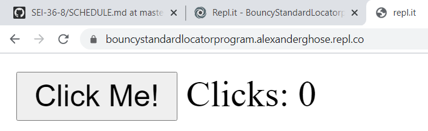

# DOM Events Lab 1

## Intro

In the _DOM Events_ lesson we saw how to run a function, i.e., an event listener, when an event, such as a click, was dispatched. This lab provides practice defining event listeners used to manipulate the DOM in response to user interaction. (It also roughly follows the <a href="../guide-to-building-a-browser-game.md">guide to building a browser game</a> which is what you will follow for developing your project 1.)

### This lab is a deliverable 

## Submission

This lab consists of 3 tasks. Each task should have a separate link in your deliverables file as there will be 2 repl.it links (for tasks1 and 2), and 1 github link (for task 3).

<br>

## Preview

In this lab, you will be building two mini-projects using DOM events (and also a little mini-project of your own choosing):
1. a click counter (preview <a href="preview_click_counter.PNG" />here</a>)
1. a morse code translator (preview <a href="preview_morse_code.PNG" />here</a>)

<br>

# Task 1 (Click Counter)

## Objective:

The goal is to make a click counter that goes up when you click the button. It should look something like this.

 

Feel free to use CSS styling to make it look prettier!

If you do need any hints, feel free to consult the hints below:

## Step 1. Setup the UI: 
1. For this lab, create a new repl.it and call it "Dom Events Task 1"
2. Replace the body of the html file with:
```html
  <body>
    <button id="btn1">Click Me!</button>
    Clicks:
    <span id="span1">0</span>
    <script src="script.js"></script>
  </body>
```

## Step 2. Organize the JS

* In your js file, organize your code by adding the following comments:
```js
/*----- app's state (variables) -----*/
/*----- cached element references -----*/
/*----- event listeners -----*/
```

## Step 3. Cache the DOM
* In the cached element references section, save a reference to your DOM elements, which will allow you to access the ```<button>```, (and also the ```<span>``` that shows the number of clicks) via the DOM:
```js
let span1 = document.getElementById("span1")
let btn1 = document.getElementById("btn1")
```

## Step 4. Attach an Event Listener:

1. In the event listeners section, write some code to attach an event listener to the ```btn1``` DOM element reference from the previous step. Your event listener should listen for a "click".
2. Within the event listener's callback function, as a test, you can put in an alert() and test it by clicking on the button. Once you've verified it's working, you may remove the alert() and move on to the next step.

## Step 5. Event Listener Logic: Updating the UI
* Within your event listener's callback function, use the reference to ```span1``` and change its ```innerHTML``` property using dot notation.

Test out your code by pressing the "click me" button and watching the counter go up!

## A note on storing data in the DOM directly

Although you can do things like span1.innerHTML += 1 directly above, this is considered to be a case of storing our application "state" (eg., the current clicks), in the DOM. 

It's a bit controversial to store data in the DOM, as you can see from the mixed opinions in <a href="https://stackoverflow.com/a/5906018/13341005">this</a> and <a href="https://stackoverflow.com/a/5906157/13341005">this</a> and <a href="https://stackoverflow.com/a/5906142/13341005">this</a> stackoverflow posts.

In this class, we will strongly suggest that it is better practice to store your state in a js variable like ```clicks``` and not directly in the DOM. And then when someone clicks, you increment the clicks variable, and then update span1.innerHTML = clicks.


# Task 2 (Free play)

## Objective:

Use Javascript to dynamically affect your web page.

### Step 1. Setup

1. For this task, create a new repl.it and call it "Dom Events Task 2: Free play".

### Step 2. Task

1. <strong>HTML:</strong>Add some elements to the HTML page. Anything you like: some images, buttons, inputs, whatever it is that makes you happy!
2. <strong>JS/DOM:</strong>Using your knowledge of the DOM, write some javascript code such that <strong>clicking on something</strong> on this page (eg., one of your buttons) causes <strong>something else</strong> on this page to change. For example:
- you may add an event listener to your image so that clicking on it changes the "src" attribute and changes to another image,
- you may add an event listener to a button that causes the "innerHTML" attribute of a `<p>` element to change,
- or, if you're not into clicks, you may listen for any other event of your choosing - eg., double click, mouseOver, .. there are a huge number of DOM events to listen for, including touch events on phones (if you want a challenge).


<br><br>

# Task 3 (Morse Code Translator)

## Objective:

The goal is to make a morse code translator on your local computer using VSCode - it should look something like this: 

If you do need any hints, feel free to consult the hints below:

## Step 1. Setup the UI
1. open up a new folder in VSCode in your local copy of the course repository.
2. create a file called index.html and replace the body with this code: 
```html
<body>
    <h1>Morse Code Translator</h1>
    Input: 
    <input id="input1" value="abc" />
    <button id="btn1">Translate!</button><br>
    Translation: <span id="span1">Waiting for click...</span>
</body>
```
3. Make a js file called script.js
4. Link your javascript file to the HTML by putting the following line just above the <body> tag in your html:
```html
<script defer src="script.js">
```
5. Test that your javascript file is correctly linked by putting an ```alert("test!")``` as the first line of the js.
6. Open the HTML file with your browser. If you see the alert, the html and js files are linked. If you don't see the alert, double check that you linked the files correctly.
7. Push this to your local fork of the course repository (ie., add, commit, and push to origin not upstream). When you finish the steps below, you will grab this link for your deliverables file.
  
## Step 2: Organize the JS
1. In your js file, organize your code by adding the following comments:
```js
/*----- app's state (variables) -----*/
/*----- cached element references -----*/
/*----- event listeners -----*/
/*----- functions -----*/
```
## Step 3: Cache the DOM
1. In the cached element references section, declare a variable called input1 and store a reference to the ```<input>``` element that has id="input1" which will contain the text the user wants translated. Hint: you can use the document.getElementById() method
2. Similarly, declare a variable called span1 and store a reference to the ```<span>``` element that has id="span1" which will contain the output of the translation
3. Similarly, declare a variable called span1 and store a reference to the ```<button>``` element that has id="btn1" which is the button in need of an event listener.
## Step 4. Attach an Event Listener:
1. In the event listeners section, write some code to attach an event listener to the ```btn1``` DOM element reference from the previous step. Your event listener should listen for a "click".
2. Within the event listener's callback function body, as a test, you can put in an alert() and test it by clicking on the button. Once you've verified that the button alert working, you may remove the alert() and move on to the next step.
## Step 5. Event Listener Logic
1. Within the event listener's callback function you created in the previous step, you will have to write some code to grab the current text in the <input> and store it into a javascript variable
2. (HINT: to get the current input text, you will access `input1.value` not `input1.innerHTML` because input text is contained within the `value` attribute unlike most other tags)
3. You will have to write some code to convert the use's <input> string from something like "abc" into a morse code `.._..___-`-type string. If this is proving difficult, for starters, you may just consider that the user will only type 1 letter (eg., "a"), and then come back to this once the rest of the code is working.
If you're dealing with just one letter, your translation code may look something like below:
```js
  let translation = ""
  if (input1.value === "a") {
     translation = "._"
  } else if (.....etc
```
But again, ideally, you would generate a translation by looping over the input string, and generate a new string .
4. Finally, now that you have your translation variable, you can update your output <span> tag by using your cached reference to that span, updating its innerHTML property to your translation variable.
Test that it works!
## A note on storing data in the DOM directly
Although this is a small app where it make sense to do something like `span1.innerHTML = translation` directly above, this is considered to be a case of storing our application "state" (eg., the current clicks), in the DOM. 
As we mentioned above, it's a bit controversial to store data in the DOM. There are mixed opinions as evidenced by <a href="https://stackoverflow.com/a/5906018/13341005">this</a> and <a href="https://stackoverflow.com/a/5906157/13341005">this</a> and <a href="https://stackoverflow.com/a/5906142/13341005">this</a> stackoverflow post.
So for larger apps, we will strongly say that it is better practice to store your state in a state variable.


### Solution for task 3

If you get stuck, a solution can be found at this link, encrypted in morse code: .... - - .--. ... ---... -..-. -..-. .-. . .--. .-.. .-....-.-....-.-....- .. - -..-. .--.-. .- .-.. . -..- .- -. -.. . .-. --. .... --- ... . -..-. -- --- .-. ... . -.-. --- -.. . 
