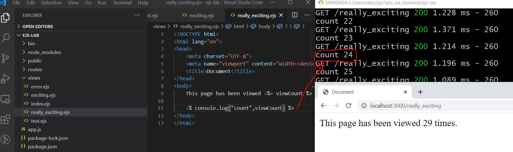

# EJS Lab

For this lab, we are going to learn some cool tricks, such as how to create a route handler that tells you how many times our website has been visited. Along the way, we will be practicing lots of EJS:


## Setup

1. Cd into your w04/d2 folder
2. Following the instructions in the express generator lesson, setup a basic express app using the express generator in a new subfolder called <strong>lab2_ejs</strong>.

<strong>Note:</strong> Starting tomorrow, we will have you rename your app.js to server.js, but for this lab please leave it as is.

For this lab, you can ignore most of the autogenerated files, except for app.js and the views/ folder where we will be adding our EJS templates.

3. Once you've run the app using ```nodemon``` and you see a screen like the following, we can begin:


## Task 1: Review res.send

Open up your express-generated project in VSCode, and follow the instructions in yesterday's lesson to <a href="../../../w04/d1/intro-to-express.md#our-first-route">setup a route handler</a> for the address "/boring" directly in your app.js or server.js file, above the // catch 404 comment. Make this route handler send a text response that says "This is a boring line of text sent with res.send". 

```js
 // add your route handler here
 app.get('/boring', function(req, res) {
   // you do this part. hint: res.send some text
 });

 // catch 404 and ..blahblah
```
Your user should now be able to navigate to the address "/boring" see this text.

Res.send is useful for quickly verifying that a route handler is working, but in production, you would prefer to return a nice HTML file using res.render:

## Task 2: Review res.render a static .ejs file

In your views/ folder, create a new file called "exciting.ejs", and put in the HTML boilerplate - head, body, etc. In the body, add some HTML of your choosing. A few pieces of text, maybe some &lt;h1&gt; tags expressing how much more exciting this method is. 

Secondly, create a route handler for the address "/notboring" just below the route handler for "/boring. Your route handler should use res.render function with 1 argument which is the file to render - render the exciting.ejs file.

```js
 app.get('/notboring', function(req, res) {
   res.render('exciting.ejs');
 });
```

Verify that your user can now navigate to the address "/notboring" see your HTML  being rendered.

Using EJS to display static HTML files is fine, but where EJS actually becomes super useful is displaying <strong>dynamic</strong> information that is calculated in the webserver, such as:

- fetching something from the database and sliding that into the HTML, or 
- calculating something, eg., website view count, which is our next task.

## Task 3: res.render with 2 arguments - dynamic template file

For task 4, you will eventually create a route handler that tells people how many times a certain page has been viewed. But to set you up for that task, let's remind ourselves about how to dynamically display variables in an EJS file:

1. Declare some variables of your choosing in our app.js, and put some data in them. For example (and please don't blindly duplicate my examples):
```js
let x = 5
let myFavouriteFruit = "kiwi"
```
2. add a route handler for the address "/dynamic_template_practice" that uses the ```res.render``` function to render an EJS file called ```test.ejs```. You can also pass in a second argument which is a javascript object containing the data we want to pass to our EJS file - in this case, our two variables above. Since it's a javascript object, it's a collection of properties that are represented as key-value pairs. Your route handler might look like this:
```js
app.get('/dynamic_template_practice', function(req, res) {
  res.render('test.ejs', {x: x, favFruit: myFavouriteFruit, name: "alex"});
});
```
3. Create the ```test.ejs``` file in the views/ folder, and put in some boilerplate HTML.
4. In the body of ```test.ejs```, put in some code to render our variables using EJS <%= %> notation, and <strong>the key</strong> names from the object we declared above:
```html
<html>
<head><title>Testing out EJS</title></head>
<body>
  The value of x is: <%= x %><br />
  My favourite fruit is: <%= favFruit %><br />
  My name is: <%= name %>
</body>
</html>
```
5. Now when your user navigates to your webserver at the URL "/dynamic_template_practice", they should see:


## Task 4: dynamic template - how many times this page has been viewed

For this task, you are going to create a route handler that tells people how many times that route has been viewed.

To get this working, please do the following:
1. declare a variable in app.js (or server.js if you renamed it) called viewCount, and initialize it to 0.
2. add a route handler for the address "/really_exciting" just below the /boring and /exciting route handlers.
3. this new route handler should use ```res.render``` and pass in two arguments: the first argument being the filename to render - in this case, let's call it 'really_exciting.ejs', and the second argument being a javascript object containing the data that we want to pass to our EJS file - in this case, the viewCount variable. Since it's a javascript object, make sure to give it a key-value pair.
4. Add in a line within your new route handler, above the res.render call that increments the viewCount variable.
4. In the views/ folder, create a file called really_exciting.ejs, and put in some boilerplate HTML.
5. In really_exciting.ejs, use <%= %> ejs notation to display the view count.
6. Verify by going to your webserver at the URL "/really_exciting", and watch the counter tick!


## Task 5: understanding <%= %> vs <% %>

In EJS, we use the <%= %> tags to render javascript expressions to HTML. Javascript expressions include:
- variables
- function calls that return something
- valid data, such as "fruit" and 7
- essentially, anything that can go in the right hand side of a variable declaration statement `(let x = righthandside)`

But we can also execute normal javascript in EJS files, using <% %> notation (no equal sign). For example, if you want to console.log the view count that your ejs file receives, modify your really_exciting.ejs file from the last task to console.log the view count, as below, and verify that it works by checking your terminal.




## Task 6: if

Modify your really_exciting.ejs file and add an "if" statement such that if the view count is more than 20, it shows the user the words "great job"!

## Task 7: Writing loops in EJS

1. Declare an array of objects of your choosing in your app.js (or server.js if you've renamed it). For fun, include an image property. An example is provided below, but make yours different with different properties with different key names and values:
```js
let pokemon = [
  {id:"000", name:"bulbasaur", image: "https://cdn.bulbagarden.net/upload/thumb/2/21/001Bulbasaur.png/375px-001Bulbasaur.png"},
  {id:"001", name:"squirtle", image:"http://static.pokemonpets.com/images/monsters-images-800-800/7-Squirtle.png"},
  {id:"002", name:"charmander", image:"https://cdn.bulbagarden.net/upload/7/73/004Charmander.png"},
]
```
2. Your task is to write the appropriate code such that, when your user visits the address /display_my_array, they should be able to see the properties of your objects in a nicely-formatted HTML list, as below. 


# Deliverable

Submit your work by pushing your code for this lab to your fork, and placing a link in your deliverables file.
